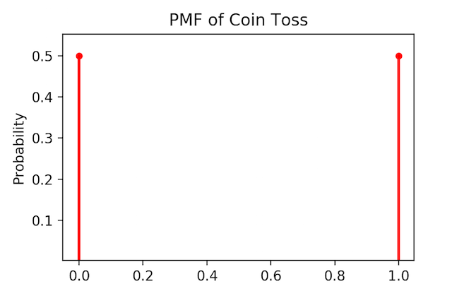
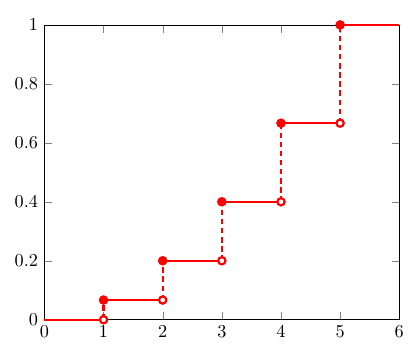
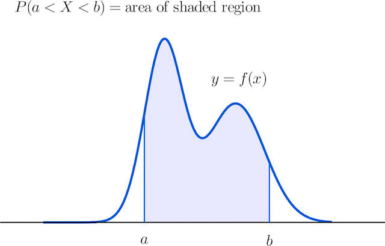

This blog-post will act as a very quick 'refresher' for material that will be of use in the rest of my Stochastic Processes course. In particular, I will be covering Random Variables, Probability Mass Functions, Probability Density Functions and Cumulative Distributions at a high-level.

## What is a Random Variable?

I think first we have to emphasize that the term 'Random Variable' is, like many things in the academic sciences, a misnomer.

In reality, the term 'Random *Function*' (or, simply **Function**?) might be better suited to describe this statistical tool, but I am just an undergrad student and my influence certainly does not rival that of history and the academic establishment. Ok...

So, why do I think 'Random *Variables*' should be rehashed as 'Random *Functions*'?
Well... Essentially what this mysterious R.V. does is it takes a 'Sample Space' (statistician speak for inputs/data) and spits out a 'Number' (output). See, just a simple Function; I give something to the Random Variable and it gives me something else in return.

Let's work with an example to see if I can convince you:

Suppose I am flipping a coin. Obviously, the two possible outcomes are Heads or Tails. We might feed this set of inputs from the Sample Space $S = (Heads, Tails)$ and get back as an output $$1$$ if the coin lands on Heads and $$0$$ if it lands on Tails. $$X(Heads)=1, X(Tails)=0$$

So as you can see there is nothing truly 'Random' or 'Variable' (or even new) in this so called 'Random Variable'. It's just a function... However, we will roll with it.

## Types of Random Variables

Now that we know about our Statistical Hammer (R.V.), let's see what different versions exist so we can use the appropriate one for the appropriate task.

### Discrete R.V.s vs. Continuous R.V.s

We call our Random Variable ***Discrete***, if it generates an exact value. For example, in the coin example we can clearly distinguish between a Tails (0) and Heads (1).

As a further example, think of the number of people at the gym on a given day. It could vary between say $$0$$ (possibly a Holiday?), $$80$$, $$42$$, etc. Nevertheless, the number of gym-goers is always a precise value. You can't have say $$14.3290410381324$$ people in the weight room. Therefore, this is a *Discrete Random Variable*, because it assigns a precise numerical result (number of people) to a variable input.

On the other hand, we call our Random Variable ***Continuous***, if it generates values in an interval.

What do I mean? Well let's go back to the gym, this time we're interested in measuring the weight of a random gym-goer. Sure, you might say our Arnold Schwarzenegger weighs $$99 kg$$, but is that exact? His weight might actually be $$98.999913871941$$ or $$99.09213124$$ or any value in the *interval* around $$99 kg$$.

Typically, as in our example, Continuous Random Variables are associated with measurements.

## Distribution Functions

"I thought this was Statistics, why aren't we talking about probabilities!?"

*Va piano... qui la tua risposta:*

### Probability Mass Function

Also called a PMF by cool people, is our way of assigning probabilities to Discrete Random Variable Outcomes.

Mathematically:

$$p_X(x)=P(X=x)$$

> Where $$p_X(x)$$ is our PMF and $$P(X=x)$$ is the probability $$P$$ that the outcome of our 'experiment' $$X$$ will be equal to the value we're interested in $$x$$

Let's go back to our original coin example. Fairly simple, our Discrete Random Variable which we called $$ X $$ would generate $$1$$ if the outcome of the coin flip was Heads and $$0$$ if the outcome of the coin flip was Tails. More explicitly:

$$
x = \begin{cases}
   1 \text{  if  } Heads  \\
   0 \text{  if  } Tails
\end{cases}
$$

Say we're interested in finding the probability that our coin will land Heads?

If we phrase that mathematically using our definition of PMF, then:

$$p_X(Heads) = P(X=Heads)$$

Which, if you remember the rules of counting and probability, should output $$50\%$$

$$p_X(Heads) = P(X=Heads) = 0.5$$

Say you're now interested in finding the probability that the coin will land Tails?

Then:

$$p_X(Tails) = P(X=Tails) = 0.5$$

Our PMF works as expected and we can even graph it out.

### Properties of PMFs

What conditions should our Probability Mass Function satisfy?

1.  Well, logically the sum of all of our probabilities should add up to 1, otherwise there is something faulty in our calculations. This can be stated mathematically, as:

    $$ 	\displaystyle\sum_{x\in X(S)}{p_X(x)}=1 $$

2. We should also make sure that all the probabilities are non-negative, otherwise how do we interpret a $$-50\%$$ chance of obtaining Heads on a coin flip? Once again, mathematically:

    $$ p_X(x) \ge 1$$

So, that's the skeleton of our PMF.

### Cumulative Distribution Functions

This simply gives us the probability that our Random Variable assumes a value that is less than or equal to a value we might be interested in. The previous phrase is denoted mathematically by:

$$F_X(x) = P(X \le x)$$

where $$F_X(x)$$ is what we call our Cumulative Distribution Function.

We can think of our CDF graphically, as the name suggests, an accumulation of probabilities.... As they say a picture is worth a thousand words and I think this holds especially true in Statistics:

Look at the graph and tell me what do you see?

Do you notice that it has this sort of 'ladder-like' structure to it? That's the accumulation of probabilities that I was talking about!

This gives us several important properties that generalizes to all CDFs:

1. They are increasing, duh... (also called monotonically increasing)
2. They are right-continuous, duh...? Wait, what? What this means is that at each 'ladder-step' (discontinuity) the graph assumes the value at the higher point. Think about it for a second, if the probabilities are increasing at some point then it makes sense that at every 'jump'/'increase' the probability that our Random Variable assumes will be larger, otherwise it wouldn't be a 'jump'?
3. As we discussed when defining the properties of PMFs, we know that the total probabilities should add up to 1, right? Well if they add up to 1 and the CDF is simply the accumulation of all the probabilities then it makes sense that the largest value the CDF can achieve is 1. Therefore, we state this mathematically:
    $$	\lim\limits_{x \to +\infty} F_X(x) = 1$$
4. A natural constraint that falls from the previous one is what is the lowest value that our CDF can achieve? We know that probabilities cannot be negative, therefore the 'accumulation process' of our CDF must start from $$0$$:
    $$\lim\limits_{x \to -\infty} F_X(x) = 0$$

By now you should be wondering: "What about assigning probabilities to Continuous Random Variables?"

### Probability Density Function

Not to be confused with your image file format pdf. A PDF is the analog of the Probability Mass Function but for Continuous Random Variables.

Why not simply use the PDF and be done with it you might protest?

Well... given the 'inexact' nature of values generated by Continuous Random Variables we can't really associate a specific probability to any of them. Therefore, we associate a probability of $$0$$ to every single value generated by our Continuous Random Variable $$X$$. Mathematically:

$$P(X=x) = 0$$

In terms of our previous gym example:

$$P(Arnold\ Schwarzenegger's\ weight=99 kg) = 0$$

And not only is it $$0\%$$ for $$99 kg$$, but it is $$0\%$$ for any *specific* weight!

Does that mean Arnold Schwarzenegger is a lie?

No, it actually boils down to the nature of our values. As already mentioned the weight can only be defined in an *interval* since Arnold Schwarzenegger's *precise* weight oscillates somewhere within an interval of values.

Hence, this is the mechanism we will use to get over this hurdle:

$$P(98\ kg \le Arnold\ Schwarzenegger's\ weight \le 100\ kg) = 1$$

In other words we are $$100\%$$ certain that the ex-Governor of California's weight oscillates somewhere between $$98 kg$$ and $$100 kg$$.

Now, imagine replicating the analysis we just did for Arnie for the entire population of gym-goers. We would end up with a distribution of probabilities that might look something like this:

This is our Probability Density Function!

As you can see our distribution neatly summarizes the probabilities within some interval attained by our Random Variable.

We can extract this aforementioned probability using our beloved technique from Real Analysis: the integral.

$$P(a \le X \le b) = \displaystyle\int_{a}^{b}f_X(x)\ dx  $$

In plain english: the probability that our Random Variable assumes some value between $$a$$ and $$b$$ is equal to the area under the curve between such $$a$$ and $$b$$ in our Probability Density Function.

### Properties of PDFs

Once again, just as in the case of the PMF, our PDF must respect some logical constraints.

1. Once again the probability given by our Probability Density Function should be non-negative. Just think about what a negative probability would mean. Therefore, we state:

    $$ f_X(x) \ge 0 $$

2. Also, as in the Discrete Case of the Probability Mass Function, the grand total probability of our PDF should be equal to 1. Therefore, we resort to the integral once again:

    $$\displaystyle\int_{-\infty}^{+\infty}f_X(x)\ dx = 1$$
